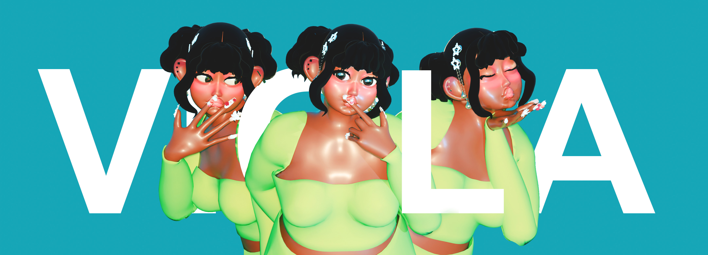
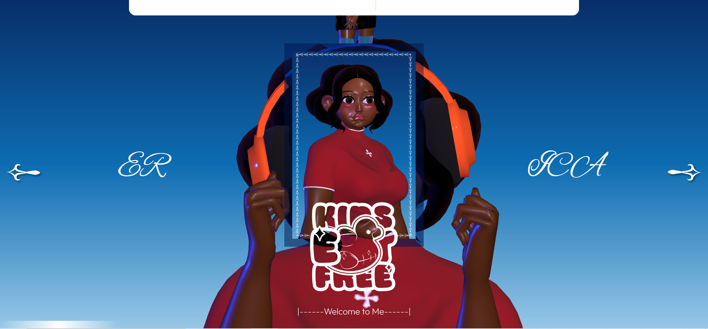
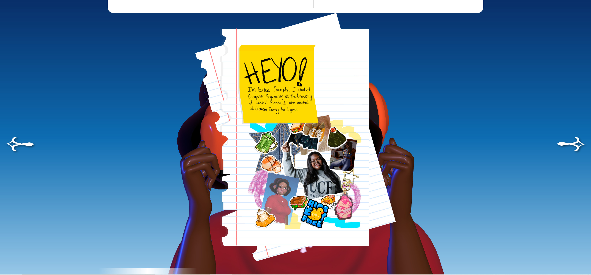
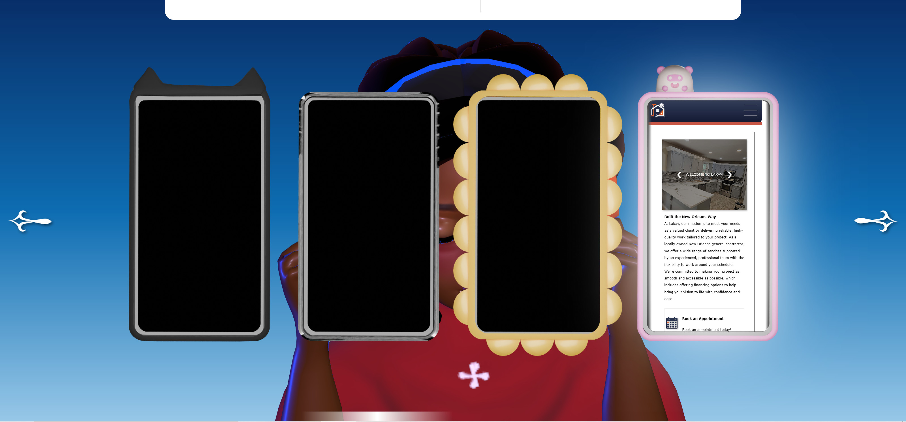
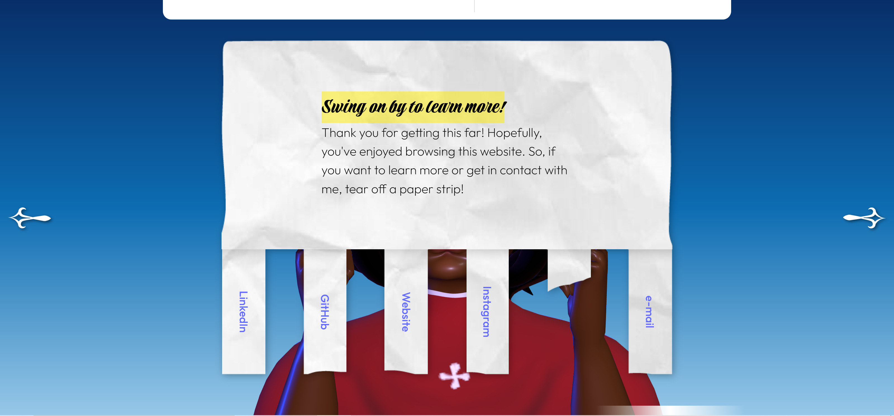
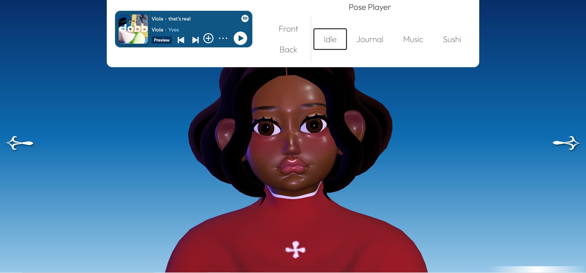

<h1>Viola</h1>

<h3>Welcome to Me</h3>

<h3>What's Up?</h3>

 
Viola is a <i>passion</i> project made with React and Three. The website was created to showcase some of my favorite CSS tricks and structures (i.e. horizontal scroll.) 

<h3>So... how?</h3>

So, Viola is made up of 3 layers - Model, Interface, Controls. Each layer was superimposed on top of each other. Calls such as disabling poiner events, allowed for the layering to function flawlessly. 

<h4>
Model
</h4>

The model is the first layer, it is a Three canvas. While it is in the background, the controls for the poses are controlled in the Interface layer. The model has a set of animations that are loaded upon the file being invoked. Lighting for the Model was also difficult, as the task was to capture the fleshy nature of a person, but still the shiny glow of the skin. 

<h4>
Interface
</h4>

The interface is the second layer and had the most moving parts. The Inteface contains the page container, which loads in the different pages, sorted in a flex-row. This caused the page to be able to load horizontally. The container clips vertical overflow to maintain the illusion.

<h4>
Controls
</h4>

The controls are the final and third layer and will require revisiting. The toolbar at the top allows users to play music, as well as change the poses for the Model in the background. The Controls load in based on a hover, it slides down. However, this requires the user to know that they must click away to release it. There is likely a simpler way to do this. There is also a bit of jerky motion when invoked improperly.

<h3> Turning a new page </h3>

<h4> Cover (Page 1) </h4>

Page 1 contains a match of the album cover the entire project is inspired by. It contains three rows to satisfy the structure of the photos while allowing dynamic resizing.

<h4> Note (Page 2) </h4>

Page 2 simply contains a notebook paper with my note to the reader. The notebook page zooms in upon hover.

<h4> Phones (Page 3) </h4>

Page 3 contains cellphones used to display some of my favorite websites from the past. When the user hovers, the phones light up to display a preview of the website.

<h4> Hobbies (Page 4) </h4>

Page 4 contains my hobbies. The obejects are floating a large piece of text. I tend to enjoy newsprint formatting and loved the aesthetic of this page. The objects light up and display a secret text upon hover as a tennis ball flights left and right.

<h4> Rip-away (Page 5) </h4>

Page 5 is the final functional page and contains a rip-away flyer for my contacts. Each tab rips away from the header, while also allowing for the link to be used. 

<h4> Blank (Page 6) </h4>

Page 6 is the final and allows the user to see the background fully. Users can play around with the Model's positions.

<h3> Thanks for reading! </h3>

